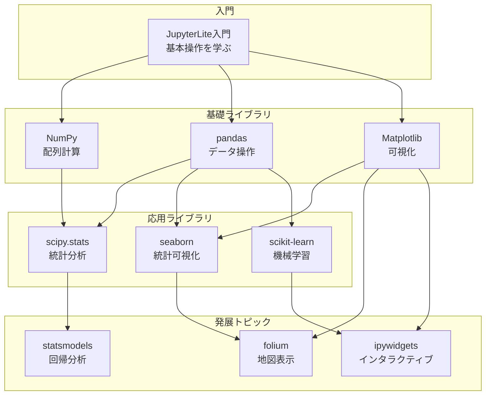

# JupyterLite チュートリアル集

ブラウザだけで動く Jupyter 環境「JupyterLite」を使って、Python データサイエンスを学ぶためのチュートリアル集です。

**インストール不要** - ブラウザで URL を開くだけで、すぐに学習を始められます。

## クイックスタート

### Step 1: JupyterLite を開く
JupyterLite のデモサイトにアクセス: https://jupyterlite.github.io/demo

### Step 2: ノートブックをアップロード
このリポジトリから `.ipynb` ファイルをダウンロードし、JupyterLite にドラッグ＆ドロップ

### Step 3: セルを実行
`Shift + Enter` でコードセルを上から順に実行

---

## 学習ロードマップ



---

## コース別学習パス

### 入門コース（プログラミング初心者向け）

| 順番 | ノートブック | 学習内容 | 所要時間目安 |
|:---:|-------------|----------|:-----------:|
| 1 | `jupyterlite/jupyterlite_beginner_tutorial_with_exercises_v2.ipynb` | Jupyter の基本操作、Python 入門 | 2時間 |
| 2 | `numpy/numpy_beginner_tutorial.ipynb` | 配列の作成、演算、統計関数 | 1.5時間 |
| 3 | `pandas/pandas_beginner_tutorial.ipynb` | DataFrame の基本操作 | 2時間 |
| 4 | `matplotlib/matplotlib_beginner_tutorial.ipynb` | グラフ作成の基本 | 1.5時間 |
| 5 | `exercises/python_beginner_exercises_34.ipynb` | 総合練習問題 34題 | 3時間 |

### データ分析コース

| 順番 | ノートブック | 学習内容 |
|:---:|-------------|----------|
| 1 | `pandas/pandas_intermediate_tutorial.ipynb` | groupby、欠損値、結合、時系列 |
| 2 | `scipy/scipy_stats_beginner_tutorial.ipynb` | 記述統計、確率分布 |
| 3 | `scipy/scipy_stats_intermediate_tutorial.ipynb` | 仮説検定、相関分析、ANOVA |
| 4 | `seaborn/seaborn_beginner_tutorial.ipynb` | 統計的可視化 |
| 5 | `statsmodels/statsmodels_jupyterlite_tutorial_v2.ipynb` | 回帰分析、統計モデリング |

### 機械学習コース

| 順番 | ノートブック | 学習内容 |
|:---:|-------------|----------|
| 1 | `numpy/numpy_intermediate_tutorial.ipynb` | 線形代数、ブロードキャスト |
| 2 | `sklearn/sklearn_beginner_tutorial.ipynb` | 前処理、回帰、分類、評価 |
| 3 | `sklearn/sklearn_intermediate_tutorial.ipynb` | アンサンブル、チューニング、クラスタリング |
| 4 | `exercises/python_intermediate_exercises_30.ipynb` | 応用練習問題 30題 |

### 地理データ可視化コース

| 順番 | ノートブック | 学習内容 |
|:---:|-------------|----------|
| 1 | `matplotlib/matplotlib_beginner_tutorial.ipynb` | グラフの基礎 |
| 2 | `folium/leaflet_folium_jupyterlite_tutorial.ipynb` | 地図表示の基礎 |
| 3 | `folium/leaflet_folium_jupyterlite_tutorial_tokai.ipynb` | GeoJSON の活用 |

---

## ノートブック一覧

### 基礎（入門）

| フォルダ | ファイル | 内容 |
|---------|---------|------|
| `jupyterlite/` | `jupyterlite_beginner_tutorial_with_exercises_v2.ipynb` | JupyterLite の基本操作と Python 入門 |
| `numpy/` | `numpy_beginner_tutorial.ipynb` | 配列の作成、インデックス、演算、統計関数 |
| `pandas/` | `pandas_beginner_tutorial.ipynb` | Series/DataFrame の基本、選択、フィルタリング |
| `matplotlib/` | `matplotlib_beginner_tutorial.ipynb` | 折れ線、散布図、棒グラフ、ヒストグラム |
| `seaborn/` | `seaborn_beginner_tutorial.ipynb` | 分布の可視化、カテゴリカルプロット |
| `scipy/` | `scipy_stats_beginner_tutorial.ipynb` | 記述統計、確率分布、正規分布 |
| `sklearn/` | `sklearn_beginner_tutorial.ipynb` | 前処理、線形回帰、分類、モデル評価 |
| `ipywidgets/` | `ipywidgets_beginner_tutorial.ipynb` | スライダー、ボタン、イベント処理 |

### 応用（中級）

| フォルダ | ファイル | 内容 |
|---------|---------|------|
| `numpy/` | `numpy_intermediate_tutorial.ipynb` | 線形代数、ブロードキャスト、構造化配列 |
| `pandas/` | `pandas_intermediate_tutorial.ipynb` | groupby、欠損値処理、結合、時系列 |
| `matplotlib/` | `matplotlib_intermediate_tutorial.ipynb` | サブプロット、軸設定、注釈 |
| `seaborn/` | `seaborn_intermediate_tutorial.ipynb` | FacetGrid、PairGrid、クラスターマップ |
| `scipy/` | `scipy_stats_intermediate_tutorial.ipynb` | 仮説検定、相関分析、分散分析 |
| `sklearn/` | `sklearn_intermediate_tutorial.ipynb` | アンサンブル学習、ハイパーパラメータ調整 |
| `statsmodels/` | `statsmodels_jupyterlite_tutorial_v2.ipynb` | 回帰分析、ロジスティック回帰、時系列分析 |

### 総合版（入門〜中級を1冊で）

| フォルダ | ファイル | 内容 |
|---------|---------|------|
| `pandas/` | `pandas_jupyterlite_tutorial.ipynb` | Series/DataFrame から groupby、結合、時系列まで |
| `matplotlib/` | `matplotlib_jupyterlite_tutorial.ipynb` | 基本グラフからサブプロット、時系列可視化、保存まで |

### 特殊トピック

| フォルダ | ファイル | 内容 |
|---------|---------|------|
| `folium/` | `leaflet_folium_jupyterlite_tutorial.ipynb` | 地図表示の基礎 |
| `folium/` | `leaflet_folium_jupyterlite_tutorial_tokai.ipynb` | GeoJSON による地域データ可視化 |
| `jupyterlite/` | `jupyterlite_xeus_r_stats_practice.ipynb` | R 統計演習（Xeus-R カーネル用） |

### 練習問題

| フォルダ | ファイル | 内容 |
|---------|---------|------|
| `exercises/` | `python_beginner_exercises_34.ipynb` | 初級練習問題 34題（Python 基礎〜statsmodels） |
| `exercises/` | `python_intermediate_exercises_30.ipynb` | 中級練習問題 30題（線形代数、仮説検定、機械学習） |
| `exercises/` | `data_analysis_exercises_20.ipynb` | データ分析 練習問題 20題（pandas中級、scipy.stats、seaborn、statsmodels） |
| `exercises/` | `machine_learning_exercises_20.ipynb` | 機械学習 練習問題 20題（NumPy中級、scikit-learn） |
| `exercises/` | `visualization_exercises_15.ipynb` | 可視化 練習問題 15題（matplotlib中級、seaborn中級） |
| `exercises/` | `geo_visualization_exercises_10.ipynb` | 地理データ可視化 練習問題 10題（folium） |

### データファイル

| フォルダ | ファイル | 内容 |
|---------|---------|------|
| `jupyterlite/` | `data.csv` | チュートリアルで使用するサンプルデータ |
| `folium/` | `tokai4_prefs.geojson` | 東海4県の GeoJSON データ（folium チュートリアル用） |

---

## Notebook の使い方

### 基本操作

| 操作 | ショートカット |
|------|---------------|
| セルを実行して次へ移動 | `Shift + Enter` |
| セルを実行（移動なし） | `Ctrl + Enter` |
| 上にセルを追加 | `A` |
| 下にセルを追加 | `B` |
| セルを削除 | `D` を2回 |
| コードセルに変更 | `Y` |
| マークダウンセルに変更 | `M` |

### 実行順序

セルは**上から順番に実行**してください。途中のセルをスキップすると、変数が未定義でエラーになります。

### 日本語表示

matplotlib で日本語を表示するには、各ノートブックの「環境準備」セルで `japanize-matplotlib-jlite` をインストールしてください。

---

## よくある質問

<details>
<summary><strong>セルを実行しても何も表示されない</strong></summary>

- `[*]:` が表示されている場合は実行中です。少し待ってください
- 代入文（`x = 10`）は出力がありません。`print(x)` で表示できます
</details>

<details>
<summary><strong>「NameError: name 'xxx' is not defined」が出る</strong></summary>

変数が定義されていません。上のセルから順番に実行し直してください。ページをリロードした場合も、最初から実行が必要です。
</details>

<details>
<summary><strong>グラフが表示されない</strong></summary>

```python
import matplotlib.pyplot as plt
plt.plot([1, 2, 3], [1, 4, 9])
plt.show()  # この行が必要
```
</details>

<details>
<summary><strong>作業内容は保存されますか？</strong></summary>

JupyterLite はブラウザのローカルストレージに保存します。`Ctrl+S` で保存、メニューの「Download」で `.ipynb` ファイルとしてダウンロードできます。
</details>

<details>
<summary><strong>追加ライブラリをインストールしたい</strong></summary>

```python
import piplite
await piplite.install("パッケージ名")
```

すべてのライブラリが対応しているわけではありません。
</details>

---

## トラブルシューティング

1. **ページをリロード** - ブラウザの更新ボタンを押す
2. **カーネルを再起動** - メニュー「Kernel」→「Restart Kernel」
3. **すべてのセルを実行** - メニュー「Run」→「Run All Cells」
4. **別のブラウザで試す** - Chrome、Firefox、Edge など

---

## 開発者向け情報

### ローカルでの実行

```bash
# 仮想環境を作成
python -m venv .venv && source .venv/bin/activate

# 依存関係をインストール
pip install -U jupyterlab jupyterlite nbconvert

# Notebook を開く
jupyter lab <ファイル名>.ipynb
```

---

## ライセンス・著者

- **著者**: 河合勝彦（名古屋市立大学大学院経済学研究科）
- **連絡先**: kkawai@econ.nagoya-cu.ac.jp
